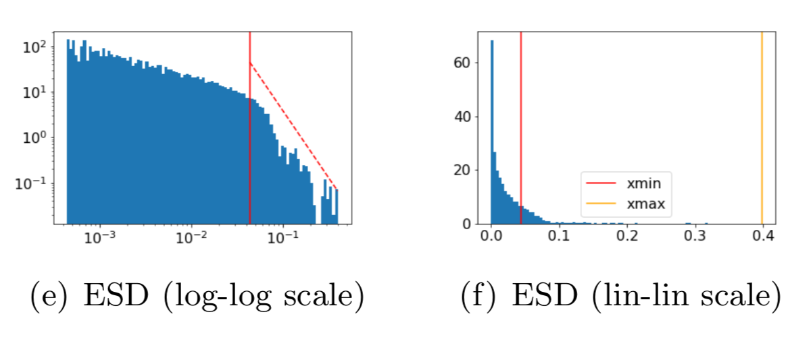

<meta name="image" property="og:image" content="https://github.com/CalculatedContent/PredictingTestAccuracies/blob/master/img/vgg-w_alphas.png">

## Weight Watcher  

### Current Version / Release: 0.4.4

**WeightWatcher**  (WW): is an open-source, diagnostic tool for analyzing Deep Neural Networks (DNN), without needing access to training or even test data. It can be used to:

- analyze pre/trained pyTorch and Keras DNN models
- inspect models that are difficult to train
- gauge improvements in model performance
- predict test accuracies across different models
- detect potential problems when compressing or fine-tuning pretrained models


#### From Research to Production
WeightWatcher is based on theoretical research (done injoint with UC Berkeley) into Why Deep Learning Works, based on our Theory of Heavy Tailed Self-Regularization (HT-SR).  It uses ideas from Random Matrix Theory (RMT), Statistical Mechanics, and Strongly Correlated Systems.

More details and demos can be found on the [Calculated Content Blog](https://calculatedcontent.com/)

## Installation

```sh
pip install weightwatcher
```

## Usage

```python
import weightwatcher as ww
import torchvision.models as models

model = models.vgg19_bn(pretrained=True)
watcher = ww.WeightWatcher(model=model)
details = watcher.analyze()
summary = watcher.get_summary(details)
```

It is as easy to run and generates a pandas dataframe with details (and plots) for each layer


and summary dict of generalization metrics

```python
    {'log_norm': 2.11,
      'alpha': 3.06,
      'alpha_weighted': 2.78,
      'log_alpha_norm': 3.21,
      'log_spectral_norm': 0.89,
      'stable_rank': 20.90,
      'mp_softrank': 0.52}]
```

### Layer Details: 

WW computes several Scale and Shape metrics for each layer Weight matrix **W**, as described in our papers (see below)

These are reported in a **details dataframe**,  including:

#### Scale Metrics 

- log Frobenius norm:  
- log Spectral norm:   

- Stable Rank:  
- MP Soft Rank:  
 
#### Shape Metrics

 - PL exponent alpha: 
 
#### Scale-adjusted Shape Metrics

- weighted alpha:  
- log alpha norm (Shatten norm): 

#### Misc Details

- N, M:  Matrix or Tensor Slice Dimensions
- D:  Quality of the (Truncated) Power law fit (D is the Kolmogorov Smirnov Distance metric)
- num_spikes:  number of spikes outside the bulk region of the ESD, when fit to an MP distribution

### Summary Statistics: 
The layer metrics are be averaged in the **summary** statistics:

Get the average metrics, as a summary (dict), from the given (or current) details dataframe

```python
details = watcher.analyze(model=model)
summary = watcher.get_summary(model)
```
or just
```python
summary = watcher.get_summary()
```

The summary statistics can be used to gauge the test error of a series of pre/trained models, without needing access to training or test data.

- average **alpha**  can be used to compare one or more DNN models with different hyperparemeter settings **&theta;**, but of the same depth.
- average **log spectral norm** is useful to compare models of different depths **L**
- average **weighted alpha** and **log alpha norm** are suitable for DNNs of differing hyperparemeters **&theta;** and depths **L** simultaneously.

## Advanced Usage 

The watcher object has several functions and analyze features described below

```python
analyze( model=None, layers=[], min_evals=0, max_evals=None,
	 plot=True, randomize=True, mp_fit=True, ww2x=False, savefig=True):
...
describe(self, model=None, layers=[], min_evals=0, max_evals=None,
         plot=True, randomize=True, mp_fit=True, ww2x=False):
...
get_details()
get_summary(details) or get_summary()
get_ESD()
...
distances(model_1, model_2)
```

#### Ploting and Fitting the Empirical Spectral Density (ESD)

WW creates plots for each layer weight matrix to observe how well the power law fits work

```python
details = watcher.analyze(plot=True)
```

For each layer, Weightwatcher plots the ESD--a histogram of the eigenvalues of the layer correlation matrix **X=W<sup>T</sup>W**.  It then fits the tail of ESD  to a (Truncated) Power Law, and plots these fits on different axes. The metrics (above) characterize the Shape and Scale of each ESD. 




### Detecting OverTraining
Weightwatcher can detect the signatures of overtraining in specific layers of a pre/trained Deep Neural Networks.

#### Eearly stopping

The weightwatcher **alpha** metric can be used to detect when to apply early stopping.  When the average **alpha** (summary statistic) drops below 2.0, this indicates that the model may be overtrained and early stopping is necesary.

Below is an example of this, showing training loss and test lost curves for  a small Transformer model, trained from scratch, along with the average **alpha** summary statistic.


We can see that as the training and test losses decrease, so does **alpha**. But when the test loss saturates and then starts to increase, **alpha** drops below 2.0.

#### Correlation Traps

The randomize option compares the ESD of the layer weight matrix (W) to the ESD of the randomized W matrix.
This is good way to visualize the correlations in the true ESD.

```python
details = watcher.analyze(randomize=True, plot=True)
```

Fig (a) is well trained; Fig (b) may be over-trained. That orange spike on the far right is the tell-tale clue; it's caled a **Correlation Trap**.  

A **Correlation Trap** is characterized by  Fig (b); here the 
actual (green) and random (red) ESDs look almost identical, except for a small shelf of correlation (just right of 0).
And for the random (red) ESD, the largest eigenvalue (orange) is far to the right of and seperated from the bulk of the ESD.


Weightwatcher will analyze your model, layer-by-layer, and show you where these kind of problems may be lurking.

### Predicting the Generalization Error

WeightWatcher (WW)can be used to compare the test error for a series of models, trained on the similar dataset, but with different hyperparameters, or even different but related architectures.  

Our Theory of HT-SR predicts that models with smaller PL exponents **alpha** , on average, correspond to models that generalize better.

The WW summary metric **alpha** (**&alpha;**) can predict the generalization **&Delta;** error when varying the model hyperparmeters **&theta;** (like batch size, learning rate, momentum, etc)

 - PL exponent alpha: 

whereas the summary metric **weighed alpha** can predict the generalization error **&Delta;**  when varying hyperparmeters **&theta;**  and depth **L**
 
 - weighted alpha:  

Here is an example of the **Weighted Alpha** capacity metric for all the current pretrained VGG models.


This can be reppduced with the [Demo Notebook](https://github.com/CalculatedContent/WeightWatcher/blob/master/WeightWatcher-VGG.ipynb)

Notice: we *did not peek* at the ImageNet test data to build this plot.

### Additional Features

#### filter by layer types 
```python
ww.LAYER_TYPE.CONV2D |  ww.LAYER_TYPE.CONV2D |  ww.LAYER_TYPE.DENSE
```
as

```python
details=watcher.analyze(layers=[ww.LAYER_TYPE.CONV2D])

```

#### filter by ids or name
```python
details=watcher.analyze(layers=[20])
```

#### minimum, maximum number of eigenvalues  of the layer weight matrix

Sets the minimum and maximum size of the weight matrices analyzed.
Setting max is useful for a quick debugging.

```python
details = watcher.analyze(min_evals=50, max_evals=500)
```

#### fit ESDs to a Marchenko-Pastur (MP) distrbution

The mp_fit option tells WW to fit each layer ESD as a Random Matrix as a Marchenko-Pastur (MP) distribution, as described in our papers on HT-SR.

```python
details = watcher.analyze(mp_fit=True, plot=True)
```
and reports the 
```python
num_spikes, mp_sigma, and mp_sofrank
```
Also works for randomized ESD and reports
```python
rand_num_spikes, rand_mp_sigma, and rand_mp_sofrank
```

#### get the ESD for a specific layer, for visualization or further analysis

```python
watcher.analyze()
esd = watcher.get_ESD()
```

#### describe a model 
Describe a model and report the details dataframe, without analyzing it

```python
details = watcher.describe(model=model)
```

#### compare 2 models 
The new distances method reports the distances between 2 models, such as the norm between the  initial weight matrices and the final, trained weight matrices

```python
details = watcher.distances(initial_model, trained_model)
```

#### compatability with version 0.2x

The new 0.4 version of weightwatcher treats each layer as a single, unified set of eigenvalues.
In contrast, the 0.2x versions split the Conv2D layers into n slices, 1 for each receptive field.
The ww2x option provides results which are back-compatable with the 0.2x version of weightwatcher,
with details provide for each slice for each layer.

```python
details = watcher.analyze(ww2x=True)
```

#### Save figures

Saves the layer ESD plots for each layer 

```python
watcher.analyze(savefig=True)
```

generating 4 files per layer
<pre>
ww.layer#.esd1.png
ww.layer#.esd2.png
ww.layer#.esd3.png
ww.layer#.esd4.png
</pre>


### Frameworks supported

- Tensorflow 2.x / Keras
- PyTorch
- HuggingFace 

### Layers supported 

- Dense / Linear / Fully Connected (and Conv1D)
- Conv2D


### Known issues

- rankloss is currently not working , may be always set to 0 

- the embedded powerlaw packages may show warning messages; you can ignore these
<pre>
   /home/xander/anaconda3/envs/my_model/lib/python3.7/site-packages/powerlaw.py:700: RuntimeWarning: divide by zero encountered in true_divide
  (Theoretical_CDF * (1 - Theoretical_CDF))
</pre>

### Demo Notebooks

[Basic Usage](https://github.com/CalculatedContent/WeightWatcher/blob/master/WeightWatcher.ipynb)

[Analyzing the VGG series](https://github.com/CalculatedContent/WeightWatcher/blob/master/WeightWatcher-VGG.ipynb)

[Using the ww2x option](https://github.com/CalculatedContent/WeightWatcher/blob/master/WeightWatcher-VGG-ww2x.ipynb)


## How to Release

Publishing to the PyPI repository:

```sh
# 1. Check in the latest code with the correct revision number (__version__ in __init__.py)
vi weightwatcher/__init__.py # Increse release number, remove -dev to revision number
git commit
# 2. Check out latest version from the repo in a fresh directory
cd ~/temp/
git clone https://github.com/CalculatedContent/WeightWatcher
cd WeightWatcher/
# 3. Use the latest version of the tools
python -m pip install --upgrade setuptools wheel twine
# 4. Create the package
python setup.py sdist bdist_wheel
# 5. Test the package
twine check dist/*
# 6. Upload the package to PyPI
twine upload dist/*
# 7. Tag/Release in github by creating a new release (https://github.com/CalculatedContent/WeightWatcher/releases/new)
```

### License

[Apache License 2.0](LICENSE.txt)


---

### Academic Presentations and Media Appearances

This tool is based on state-of-the-art research done in collaboration with UC Berkeley:


- [Implicit Self-Regularization in Deep Neural Networks: Evidence from Random Matrix Theory and Implications for Learning](https://arxiv.org/abs/1810.01075)

- [Traditional and Heavy Tailed Self Regularization in Neural Network Models](https://arxiv.org/abs/1901.08276)

  - Notebook for above 2 papers (https://github.com/CalculatedContent/ImplicitSelfRegularization)

- [ICML 2019 Theoretical Physics Workshop Paper](https://github.com/CalculatedContent/PredictingTestAccuracies/blob/master/ICMLPhysicsWorkshop/icml_prl_TPDLW2019_fin.pdf)

- [Heavy-Tailed Universality Predicts Trends in Test Accuracies for Very Large Pre-Trained Deep Neural Networks](https://arxiv.org/abs/1901.08278)

  - Notebook for paper (https://github.com/CalculatedContent/PredictingTestAccuracies)

---
and has been presented at Stanford, UC Berkeley, etc:

- [NERSC Summer 2018](https://www.youtube.com/watch?v=_Ni5UDrVwYU)
- [UC Berkeley/ICSI 12/13/2018](https://www.youtube.com/watch?v=6Zgul4oygMc)

- [Institute for Pure & Applied Mathematics (IPAM)](https://www.youtube.com/watch?v=fmVuNRKsQa8)
- [Physics Informed Machine Learning](https://www.youtube.com/watch?v=eXhwLtjtUsI)

---
and major AI  conferences like ICML, KDD, etc.

- [KDD 2019 Workshop: Statistical Mechanics Methods for Discovering Knowledge from Production-Scale Neural Networks](https://dl.acm.org/doi/abs/10.1145/3292500.3332294)   

- [KDD 2019 Workshop: Slides](https://www.stat.berkeley.edu/~mmahoney/talks/dnn_kdd19_fin.pdf)


#### KDD2019 Workshop

[KDD 2019 Workshop: Statistical Mechanics Methods for Discovering
Knowledge from Production-Scale Neural Networks](https://dl.acm.org/doi/abs/10.1145/3292500.3332294)

[KDD 2019 Workshop: Slides](https://www.stat.berkeley.edu/~mmahoney/talks/dnn_kdd19_fin.pdf) 

#### Popular Popdcasts and Blogs

and has been the subject  many popular podcasts

- [This Week in ML](https://twimlai.com/meetups/implicit-self-regularization-in-deep-neural-networks/)

- [Data Science at Home Podcast](https://podcast.datascienceathome.com/e/episode-70-validate-neural-networks-without-data-with-dr-charles-martin/)

- [Aggregate Intellect VLog](https://aisc.ai.science/events/2019-11-06)

- [Rebellion Research VLog](https://www.linkedin.com/feed/update/urn:li:activity:6759316071230136320/)

- [Rebellion Research BLog](https://www.rebellionresearch.com/why-does-deep-learning-work)

---
#### Latest paper and results

[Talk at Stanford ICME 2020](https://www.youtube.com/watch?v=PQUItQi-B-I)

[(Early Prepreint) Predicting trends in the quality of state-of-the-art neural networks without access to training or testing data](https://arxiv.org/pdf/2002.06716.pdf)

[Repo for latest paper, published in Nature Communications](https://github.com/CalculatedContent/ww-trends-2021)

#### 2021 Short Presentations

[MLC Research Jam  March 2021](presentations/ww_5min_talk.pdf)

[PyTorch2021 Poster  April 2021](presentations/pytorch2021_poster.pdf)


## Slack Channel

We have a slack channel for the tool if you need help
For an invite, please send an email to charles@calculationconsulting.com


#### Contributors

[Charles H Martin, PhD](https://www.linkedin.com/in/charlesmartin14)
[Calculation Consulting](https://calculationconsulting.com)

[Serena Peng](https://www.linkedin.com/in/serenapeng)

#### Consulting Practice

[Calculation Consulting homepage](https://calculationconsulting.com)

[Calculated Content Blog](https://calculatedcontent.com)
