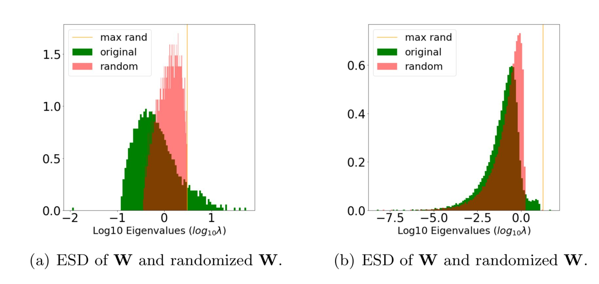

[](http://pepy.tech/project/weightwatcher)
[](https://pypi.org/project/weightwatcher/)
[](./LICENSE.txt)
[](https://nature.com/articles/s41467-021-24025-8)
[](https://www.youtube.com/watch?v=Tnafo6JVoJs)
[](https://discord.gg/uVVsEAcfyF)
[](https://www.linkedin.com/in/charlesmartin14/)
[](https://www.calculatedcontent.com)


**WeightWatcher** (WW) is an open-source, diagnostic tool for analyzing Deep Neural Networks (DNN), without needing access to training or even test data.  It is based on theoretical research into Why Deep Learning Works, based on our Theory of Heavy-Tailed Self-Regularization (HT-SR).  It uses ideas from Random Matrix Theory (RMT), Statistical Mechanics, and Strongly Correlated Systems.

It can be used to:

- analyze pre/trained pyTorch, Keras, DNN models (Conv2D and Dense layers)
- monitor models, and the model layers, to see if they are over-trained or over-parameterized
- predict test accuracies across different models, with or without training data
- detect potential problems when compressing or fine-tuning pretrained models
- layer warning labels: over-trained; under-trained


## Quick Links 

- Please see [our latest talk from the Sillicon Valley ACM meetup](https://www.youtube.com/watch?v=Tnafo6JVoJs)

- Join the [Discord Server](https://discord.gg/uVVsEAcfyF) 

- For a deeper dive into the theory, see [our latest talk at ENS](https://youtu.be/xEuBwBj_Ov4)

- and the most recent podcast (https://changelog.com/practicalai/194)

- More details and demos can be found on the [Calculated Content Blog](https://calculatedcontent.com/)

And in the notebooks provided in the [examples](https://github.com/CalculatedContent/WeightWatcher/tree/master/examples) directory

## Installation:  Version 0.6.4

```sh
pip install weightwatcher
```

### Current TestPyPI Version: 0.7

```sh
 python3 -m pip install --index-url https://test.pypi.org/simple/ --extra-index-url https://pypi.org/simple weightwatcher
 ```

## Usage

```python
import weightwatcher as ww
import torchvision.models as models

model = models.vgg19_bn(pretrained=True)
watcher = ww.WeightWatcher(model=model)
details = watcher.analyze()
summary = watcher.get_summary(details)
```

It is as easy to run and generates a pandas dataframe with details (and plots) for each layer


and `summary` dictionary of generalization metrics

```python
    {'log_norm': 2.11,
      'alpha': 3.06,
      'alpha_weighted': 2.78,
      'log_alpha_norm': 3.21,
      'log_spectral_norm': 0.89,
      'stable_rank': 20.90,
      'mp_softrank': 0.52}
```

## Advanced Usage 

The `watcher` object has several functions and analysis features described below

Notice the min_evals setting:  the power law fits need at least 50 eigenvalues to make sense
but the describe and other methods do not

```python
watcher.analyze(model=None, layers=[], min_evals=50, max_evals=None,
	 plot=True, randomize=True, mp_fit=True, ww2x=False, savefig=True):
...
watcher.describe(self, model=None, layers=[], min_evals=0, max_evals=None,
         plot=True, randomize=True, mp_fit=True, ww2x=False):
...
watcher.get_details()
watcher.get_summary(details) or get_summary()
watcher.get_ESD()
...
watcher.distances(model_1, model_2)
```

## Ploting and Fitting the Empirical Spectral Density (ESD)

WW creates plots for each layer weight matrix to observe how well the power law fits work

```python
details = watcher.analyze(plot=True)
```

For each layer, WeightWatcher plots the ESD--a histogram of the eigenvalues of the layer correlation matrix **X=W<sup>T</sup>W**.  It then fits the tail of ESD to a (Truncated) Power Law, and plots these fits on different axes. The summary metrics (above) characterize the Shape and Scale of each ESD.  Here's an example:


Generally speaking, the ESDs in the best layers, in the best DNNs can be fit to a Power Law (PL), with PL exponents `alpha` closer to `2.0`.
Visually, the ESD looks like a straight line on a log-log plot (above left).

## Generalization Metrics

<details>
  <summary>
The goal of the WeightWatcher project is find generalization metrics that most accurately reflect observed test accuracies, across many different models and architectures, for pre-trained models and models undergoing training.
	  
</summary>
	

[Our HTSR theory](https://jmlr.org/papers/volume22/20-410/20-410.pdf) says that well trained, well correlated layers should be signficantly different from the MP (Marchenko-Pastur) random bulk, and specifically to be heavy tailed. There are different layer metrics in WeightWatcher for this, including:

- `rand_distance` : the  distance in distribution from the randomized layer
- `alpha` : the slope of the tail of the ESD, on a log-log scale
- `alpha-hat` or `alpha_weighted` : a scale-adjusted form of `alpha` (similar to the alpha-shatten-Norm)
- `stable_rank` : a norm-adjusted measure of the scale of the ESD
- `num_spikes` : the number of spikes outside the MP bulk region
- `max_rand_eval` : scale of the random noise etc

All of these attempt to measure how on-random and/or non-heavy-tailed the layer ESDs are.  


#### Scale Metrics 

- log Frobenius norm :  
- `log_spectral_norm` :   

- `stable_rank` :  
- `mp_softrank` :  
 
#### Shape Metrics

 - `alpha` :  Power Law (PL) exponent 
 - (Truncated) PL quality of fit `D` :  (the Kolmogorov Smirnov Distance metric)


(advanced usage)
 - TPL : (alpha and Lambda) Truncated Power Law Fit
 - E_TPL : (alpha and Lambda) Extended Truncated Power Law Fit
 
#### Scale-adjusted Shape Metrics

- `alpha_weighted` :  
- `log_alpha_norm` : (Shatten norm): 

#### Direct Correlation Metrics 

The random distance metric is a new, non-parameteric approach that appears to work well in early testing.
 [See this recent blog post](https://calculatedcontent.com/2021/10/17/fantastic-measures-of-generalization-that-actually-work-part-1/)

- `rand_distance` :    Distance of layer ESD from the ideal RMT MP ESD

There re also related metrics, including the new

- 'ww_maxdist'
- 'ww_softrank'

#### Misc Details

- `N, M` :  Matrix or Tensor Slice Dimensions
- `num_spikes` :  number of spikes outside the bulk region of the ESD, when fit to an MP distribution
- `num_rand_spikes` :  number of Correlation Traps
- `max_rand_eval` : scale of the random noise in the layer


#### Summary Statistics: 
The layer metrics are averaged in the **summary** statistics:

Get the average metrics, as a `summary` (dict), from the given (or current) `details` dataframe

```python
details = watcher.analyze(model=model)
summary = watcher.get_summary(model)
```
or just
```python
summary = watcher.get_summary()
```

The summary statistics can be used to gauge the test error of a series of pre/trained models, without needing access to training or test data.

- average `alpha` can be used to compare one or more DNN models with different hyperparemeter settings **&theta;**, when depth is not a driving factor (i.e transformer models)
- average `log_spectral_norm` is useful to compare models of different depths **L** at a coarse grain level
- average `alpha_weighted` and `log_alpha_norm` are suitable for DNNs of differing hyperparemeters **&theta;** and depths **L** simultaneously. (i.e CV models like VGG and ResNet)
	
#### Predicting the Generalization Error


WeightWatcher (WW) can be used to compare the test error for a series of models, trained on the similar dataset, but with different hyperparameters **&theta;**, or even different but related architectures.  
	
Our Theory of HT-SR predicts that models with smaller PL exponents `alpha`, on average, correspond to models that generalize better.

Here is an example of the `alpha_weighted` capacity metric for all the current pretrained VGG models.


Notice: we *did not peek* at the ImageNet test data to build this plot.
	
This can be reproduced with the Examples Notebooks for [VGG](https://github.com/CalculatedContent/WeightWatcher/blob/master/examples/WW-VGG.ipynb) and also for [ResNet](https://github.com/CalculatedContent/WeightWatcher/blob/master/examples/WW-ResNet.ipynb)

</details>

## Detecting signs of Over-Fitting and Under-Fitting

WeightWatcher can help you detect the signatures of over-fitting and under-fitting in specific layers of a pre/trained Deep Neural Networks.

WeightWatcher will analyze your model, layer-by-layer, and show you where these kind of problems may be lurking.

### Correlation Traps

<details>
 <summary>
The <code>randomize</code> option lets you compare the ESD of the layer weight matrix (W) to the ESD of its randomized form.
This is good way to visualize the correlations in the true ESD, and detect signatures of over- and under-fitting
 </summary>

	
```python
details = watcher.analyze(randomize=True, plot=True)
```

Fig (a) is well trained; Fig (b) may be over-fit.
	
That orange spike on the far right is the tell-tale clue; it's caled a **Correlation Trap**.  

A **Correlation Trap** is characterized by Fig (b); here the actual (green) and random (red) ESDs look almost identical, except for a small shelf of correlation (just right of 0). And random (red) ESD, the largest eigenvalue (orange) is far to the right of and seperated from the bulk of the ESD.
	

	
When layers look like Figure (b) above, then they have not been trained properly because they look almost random, with only a little bit of information present. And the information the layer learned may even be spurious.
	
Moreover, the metric `num_rand_spikes` (in the `details` dataframe) contains the number of spikes (or traps) that appear in the layer.

The `SVDSharpness` transform can be used to remove Correlation Traps during training (after each epoch) or after training using 
	
```python
sharpemed_model = watcher.SVDSharpness(model=...)
```
	
Sharpening a model is similar to clipping the layer weight matrices, but uses Random Matrix Theory to do this in a more principle way than simple clipping.
	
</details>

### Early Stopping
<details>
 <summary>
	 <b>Note:</b> This is experimental but we have seen some success here
 </summary>
	
The WeightWatcher `alpha` metric may be used to detect when to apply early stopping.  When the average `alpha` (summary statistic) drops below `2.0`, this indicates that the model may be over-trained and early stopping is necesary.

Below is an example of this, showing training loss and test lost curves for a small Transformer model, trained from scratch, along with the average `alpha` summary statistic.


We can see that as the training and test losses decrease, so does `alpha`. But when the test loss saturates and then starts to increase, `alpha` drops below `2.0`.
	
**Note:** this only work for very well trained models, where the optimal `alpha=2.0` is obtained
	
</details>


<hr>


## Additional Features

<details>
<summary>
There are many advanced features, described below
</summary>

<hr>

### Filtering

---

#### filter by layer types 
	
```python
ww.LAYER_TYPE.CONV2D | ww.LAYER_TYPE.CONV2D | ww.LAYER_TYPE.DENSE
```
as

```python
details=watcher.analyze(layers=[ww.LAYER_TYPE.CONV2D])

```

#### filter by layer ID or name
	
```python
details=watcher.analyze(layers=[20])
```

### Calculations

---

#### minimum, maximum number of eigenvalues of the layer weight matrix

Sets the minimum and maximum size of the weight matrices analyzed.
Setting max is useful for a quick debugging.

```python
details = watcher.analyze(min_evals=50, max_evals=500)
```

#### specify the Power Law fitting proceedure

To replicate results using TPL or E_TPL fits, use:

```python
details = watcher.analyze(fit='PL'|'TPL'|'E_TPL')
```

The `details` dataframe will now contain two quality metrics, and for each layer:
- `alpha` : basically (but not exactly) the same PL exponent as before, useful for `alpha > 2.0`
- `Lambda` : a new metric, now useful when the (TPL) `alpha < 2.0`

(The TPL fits correct a problem we have had when the PL fits over-estimate `alpha` for TPL layers)

As with the `alpha` metric, smaller `Lambda` implies better generalization.

### Visualization

---

#### Save all model figures

Saves the layer ESD plots for each layer 

```python
watcher.analyze(savefig=True,savefig='/plot_save_directory')
```

generating 4 files per layer
<pre>
ww.layer#.esd1.png
ww.layer#.esd2.png
ww.layer#.esd3.png
ww.layer#.esd4.png
</pre>

**Note:** additional plots will be saved when `randomize` option is used
							       
#### fit ESDs to a Marchenko-Pastur (MP) distrbution

The `mp_fit` option tells WW to fit each layer ESD as a Random Matrix as a Marchenko-Pastur (MP) distribution, as described in our papers on HT-SR.

```python
details = watcher.analyze(mp_fit=True, plot=True)
```
and reports the 
```python
num_spikes, mp_sigma, and mp_sofrank
```
Also works for randomized ESD and reports
```python
rand_num_spikes, rand_mp_sigma, and rand_mp_sofrank
```

#### fetch the ESD for a specific layer, for visualization or additional analysis

```python
watcher.analyze()
esd = watcher.get_ESD()
```

### Model Analysis

---

#### describe a model 
Describe a model and report the `details` dataframe, without analyzing it

```python
details = watcher.describe(model=model)
```

#### comparing two models 
The new distances method reports the distances between two models, such as the norm between the initial weight matrices and the final, trained weight matrices

```python
details = watcher.distances(initial_model, trained_model)
```

### Compatability

---

#### compatability with version 0.2.x

The new 0.4.x version of WeightWatcher treats each layer as a single, unified set of eigenvalues.
In contrast, the 0.2.x versions split the Conv2D layers into n slices, one for each receptive field.
The `ww2x` option provides results which are back-compatable with the 0.2.x version of WeightWatcher,
with details provide for each slice for each layer.

```python
details = watcher.analyze(ww2x=True)
```

</details>

<hr>

## Requirements

- Python 3.7+

### Frameworks supported

- Tensorflow 2.x / Keras
- PyTorch 1.x
- HuggingFace 

Note:  the current version requires both tensorflow and torch; if there is demand, this will be updates to make installation easier.

### Layers supported 

- Dense / Linear / Fully Connected (and Conv1D)
- Conv2D

## Tips for First Time Users

<details>
<summary>
On using WeighWtatcher for the first time.  I recommend selecting at least one trained model, and running `weightwatcher` with all analyze options enabled, including the plots.  From this, look for:
</summary>

- if the layers ESDs are well formed and heavy tailed
- if any layers are nearly random, indicating they are not well trained
- if all the power law a fits appear reasonable, and `xmin` is small enough that the fit captures a reasonable section of the ESD tail

Moreover, the Power Laws and alpha fit only work well when the ESDs are both heavy tailed *and* can be easily fit to a single power law.
Occasionally the power law and/or alpha fits don't work.  This happens when
- the ESD is random (not heavy tailed), `alpha > 8.0`
- the ESD is multimodal (rare, but does occur)
- the ESD is heavy tailed, but not well described by a single power law.  In these cases, sometimes `alpha` only fits the the **very last** part of the tail, and is **too** large. This is easily seen on the Lin-Lin plots

In any of these cases, I usually throw away results where `alpha > 8.0` because they are spurious. If you suspect your layers are undertrained, you have to look both at `alpha` and a plot of the ESD itself (to see if it is heavy tailed or just random-like).

</details>
	
<hr>

## How to Release
<details>
<summary>
Publishing to the PyPI repository:
</summary>

```sh
# 1. Check in the latest code with the correct revision number (__version__ in __init__.py)
vi weightwatcher/__init__.py # Increse release number, remove -dev to revision number
git commit
# 2. Check out latest version from the repo in a fresh directory
cd ~/temp/
git clone https://github.com/CalculatedContent/WeightWatcher
cd WeightWatcher/
# 3. Use the latest version of the tools
python -m pip install --upgrade setuptools wheel twine
# 4. Create the package
python setup.py sdist bdist_wheel
# 5. Test the package
twine check dist/*
# 7. Upload the package to TestPyPI first
twine upload --repository testpypi dist/*
# 8. Test the TestPyPI install
python3 -m pip install --index-url https://test.pypi.org/simple/ weightwatcher
...
# 9. Upload to actual PyPI
twine upload dist/*
# 10. Tag/Release in github by creating a new release (https://github.com/CalculatedContent/WeightWatcher/releases/new)
```

</details>

<hr>

## License

[Apache License 2.0](LICENSE.txt)

<hr>

## Academic Presentations and Media Appearances

This tool is based on state-of-the-art research done in collaboration with UC Berkeley:

<details>
<summary>
WeightWatcher has been featured in top journals like JMLR and Nature:	
</summary>
#### Latest papers and talks

- [SETOL: A Semi-Empirical Theory of (Deep) Learning] (in progress)

- [Post-mortem on a deep learning contest: a Simpson's paradox and the complementary roles of scale metrics versus shape metrics](https://arxiv.org/abs/2106.00734)

- [Evaluating natural language processing models with robust generalization metrics that do not need access to any training or testing data](https://arxiv.org/abs/2202.02842)

- [(Nature paper) Predicting trends in the quality of state-of-the-art neural networks without access to training or testing data](https://www.nature.com/articles/s41467-021-24025-8)

  - [Repo for Nature paper](https://github.com/CalculatedContent/ww-trends-2020)

- [(JMLR in press) Implicit Self-Regularization in Deep Neural Networks: Evidence from Random Matrix Theory and Implications for Learning](https://arxiv.org/abs/1810.01075)

- [Traditional and Heavy Tailed Self Regularization in Neural Network Models](https://arxiv.org/abs/1901.08276)

  - Notebook for above 2 papers (https://github.com/CalculatedContent/ImplicitSelfRegularization)

- [ICML 2019 Theoretical Physics Workshop Paper](https://github.com/CalculatedContent/PredictingTestAccuracies/blob/master/ICMLPhysicsWorkshop/icml_prl_TPDLW2019_fin.pdf)

- [Heavy-Tailed Universality Predicts Trends in Test Accuracies for Very Large Pre-Trained Deep Neural Networks](https://arxiv.org/abs/1901.08278)

  - Notebook for paper (https://github.com/CalculatedContent/PredictingTestAccuracies)

- [Rethinking generalization requires revisiting old ideas: statistical mechanics approaches and complex learning behavior](https://arxiv.org/abs/1710.09553)
	
</details>

<details>
<summary>
and has been presented at Stanford, UC Berkeley, KDD, etc:
</summary>

- [NERSC Summer 2018](https://www.youtube.com/watch?v=_Ni5UDrVwYU)
- [UC Berkeley/ICSI 12/13/2018](https://www.youtube.com/watch?v=6Zgul4oygMc)

- [Institute for Pure & Applied Mathematics (IPAM)](https://www.youtube.com/watch?v=fmVuNRKsQa8)
- [Physics Informed Machine Learning](https://www.youtube.com/watch?v=eXhwLtjtUsI)

- [Talk at Stanford ICME 2020](https://www.youtube.com/watch?v=PQUItQi-B-I)

- [Talk at UCL (UK) 2022](https://www.youtube.com/watch?v=sOXROWJ70Pg)

#### KDD2019 Workshop

- [KDD 2019 Workshop: Statistical Mechanics Methods for Discovering
  Knowledge from Production-Scale Neural Networks](https://dl.acm.org/doi/abs/10.1145/3292500.3332294)

- [KDD 2019 Workshop: Slides](https://www.stat.berkeley.edu/~mmahoney/talks/dnn_kdd19_fin.pdf) 
	
</details>

<details>
<summary>
WeightWatcher has also been featured at local meetups and many popular podcasts
</summary>
	
#### Popular Popdcasts and Blogs

- [This Week in ML](https://twimlai.com/meetups/implicit-self-regularization-in-deep-neural-networks/)
 
- [Data Science at Home Podcast](https://podcast.datascienceathome.com/e/episode-70-validate-neural-networks-without-data-with-dr-charles-martin/)

- [Aggregate Intellect VLog](https://aisc.ai.science/events/2019-11-06)

- [Rebellion Research VLog](https://blog.rebellionresearch.com/blog/theoretical-physicist-dr-charles-martin-on-deep-learning)

- [Rebellion Research BLog](https://www.rebellionresearch.com/why-does-deep-learning-work)

- [LightOn AI Meetup](https://www.youtube.com/watch?v=tciq7t3rj98)

- [The Sillicon Valley ACM meetup](https://www.youtube.com/watch?v=Tnafo6JVoJs)

- [Applied AI Community](https://www.youtube.com/watch?v=xLZOf2IDLkc&feature=youtu.be)

- [Practical AI](https://changelog.com/practicalai/194)

- [Latest Results](https://www.youtube.com/watch?v=rojbXvK9mJg)

#### 2021 Short Presentations

- [MLC Research Jam  March 2021](presentations/ww_5min_talk.pdf)

- [PyTorch2021 Poster  April 2021](presentations/pytorch2021_poster.pdf)

#### Recent talk(s) by Mike Mahoney, UC Berekely

- [IARAI, the Institute for Advanced Research in Artificial Intelligence](https://www.youtube.com/watch?v=Pirni67ZmRQ)

</details>

<hr>

## Experimental / Most Recent version    (not ready yet)

You may install the latest / Trunk from testpypi

	python3 -m pip install --index-url https://test.pypi.org/simple/ --extra-index-url https://pypi.org/simple weightwatcher

The testpypi version usually has the most recent updates, including experimental methods and bug fixes.
But pypi has changed the way it handles testpypi requiring non-testpypi dependencies.
e.g., torch and tensorflow fail on testpypi

If you have them installed already in your env, you're fine.
Otherwise, you need to install them first
<hr>

## Contributors

[Charles H Martin, PhD](https://www.linkedin.com/in/charlesmartin14)
[Calculation Consulting](https://calculationconsulting.com)

[Serena Peng](https://www.linkedin.com/in/serenapeng)

<hr>

#### Consulting Practice

[Calculation Consulting homepage](https://calculationconsulting.com)

[Calculated Content Blog](https://calculatedcontent.com)
